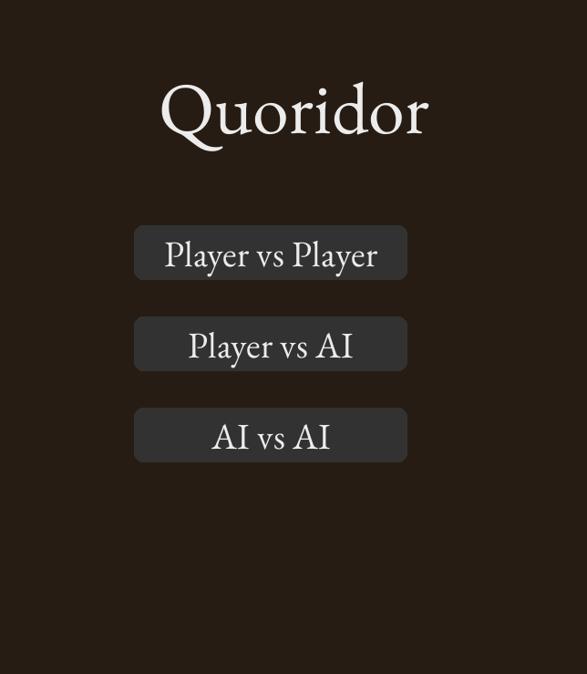

# Quoridor AI 🔵🔴

A feature-rich implementation of the abstract strategy board game Quoridor, built from the ground up in Python with Pygame. This project features a polished graphical user interface, smooth animations, and a challenging AI opponent powered by a time-controlled, iterative-deepening Minimax algorithm.

<br>

<p align="center">
  
</p>

---

## 📋 Table of Contents

*   [About The Game: What is Quoridor?](#about-the-game-what-is-quoridor)
*   [✨ Features](#-features)
*   [🧠 The AI Engine: A Deep Dive](#-the-ai-engine-a-deep-dive)
    *   [Core Algorithm: Minimax with Alpha-Beta Pruning](#core-algorithm-minimax-with-alpha-beta-pruning)
    *   [The Heuristic Brain: The Evaluation Function](#the-heuristic-brain-the-evaluation-function)
    *   [Iterative Deepening & Time Control](#iterative-deepening--time-control)
    *   [Inspired by Research](#inspired-by-research)
*   [📸 Screenshots](#-screenshots)
*   [▶️ How to Play](#️-how-to-play)
    *   [Using the Executable (Easy)](#using-the-executable-easy)
    *   [Running from Source (Developer)](#running-from-source-developer)
*   [📁 Project Structure](#-project-structure)
*   [🛠️ Built With](#️-built-with)
*  [💡 Challenges & Lessons Learned](#-challenges--lessons-learned)
*  [🚀 Future Improvements](#-future-improvements)
*  [📜 License](#-license)

---

## About The Game: What is Quoridor?

Quoridor is a 2 or 4-player abstract strategy game that is simple to learn but surprisingly deep. Played on a 9x9 board, the objective is straightforward: be the first player to move your pawn to the opposite side of the board.

The twist comes from the twenty "walls" that players can place on the board. On each turn, a player can choose to either **move their pawn** one space or **place a wall** to obstruct the path of their opponent. Walls can be used defensively to protect your own path or offensively to create a maze for your opponent, dramatically lengthening their journey. The catch? You can never place a wall that completely blocks off a player's last remaining path to their goal.

This creates a fascinating tension between racing to the finish line and strategically managing your limited supply of walls to outwit your opponent.

---

## ✨ Features

This project was built iteratively to be a complete and polished gaming experience.

*   **Complete Quoridor Ruleset:** Implements all official rules, including standard pawn movement, jumping, and illegal wall placement detection using a Breadth-First Search (BFS) pathfinding algorithm.
*   **Multiple Game Modes:**
    *   **Player vs. Player:** A classic hot-seat mode.
    *   **Player vs. AI:** Test your skills against the computer.
    *   **AI vs. AI:** A spectator mode to observe the AI's strategies.
*   **Intelligent Minimax AI:** A highly competent AI opponent that uses an iterative-deepening Minimax search with alpha-beta pruning to think multiple steps ahead.
*   **Polished Graphical User Interface:** A clean, modern UI built with Pygame, featuring custom fonts and a cohesive color palette.
*   **Fluid Animations:** Smooth, constant-speed pawn animations that provide a professional "game feel."
*   **Intuitive Player Feedback:**
    *   A "ghost wall" preview shows where a wall will be placed on hover (Blue for valid, Red for invalid).
    *   Valid pawn moves are highlighted with a subtle, pulsing animation.
    *   An animated "thinking" indicator shows when the AI is calculating its next move.
*   **Live Evaluation Bar:** A vertical bar, inspired by modern chess engines, that displays the AI's real-time evaluation of who is winning the game.

---

## 🧠 The AI Engine: A Deep Dive

The heart of this project is the AI. Its development was a process of refinement, moving from a simple algorithm to a much more robust and intelligent system.

### Core Algorithm: Minimax with Alpha-Beta Pruning

The AI uses the classic **Minimax** algorithm, a staple of board game AI. It explores a "game tree" of possible future moves, assuming that it (the "Maximizer") will always choose the move that leads to the best possible score for itself, and that the opponent (the "Minimizer") will always choose the move that leads to the worst score for the AI.

**Alpha-Beta Pruning** is a crucial optimization layered on top. It allows the AI to "prune" entire branches of the game tree that it knows it doesn't need to explore, dramatically speeding up the search and allowing it to think deeper in the same amount of time.

### The Heuristic Brain: The Evaluation Function

A Minimax search is only as smart as its **evaluation function**—the "brain" that assigns a score to a given board position. After experimenting with more complex heuristics, I settled on a simple, pure, and highly effective evaluation:

`score = (Opponent's Shortest Path) - (AI's Shortest Path)`

The AI's entire strategy boils down to making the move that creates the most favorable difference between these two path lengths. A wall placement is considered "good" not because it's a wall, but because of the *effect* it has on this core equation. This prevents the AI from hoarding its walls (a bug in an earlier version) and encourages it to use them as offensive weapons to lengthen the opponent's path.

### Iterative Deepening & Time Control

To overcome the "horizon effect" and avoid impossibly long calculation times at high search depths, the AI uses **Iterative Deepening**. Instead of searching to a fixed depth, it's given a time budget (e.g., 3-5 seconds).
1.  It first solves the entire game tree for `Depth = 1`.
2.  It then solves for `Depth = 2`.
3.  Then `Depth = 3`, and so on...
4.  Once the time limit is reached, it stops and uses the best move it found from the last *fully completed* depth level. This ensures the AI always makes a move in a reasonable amount of time and gets progressively stronger on faster hardware.

### Inspired by Research

The AI's intelligence was significantly boosted by drawing inspiration from academic research on Quoridor agents, such as the work of Glendenning et al. and the MCTS-focused paper by Brown et al. The key idea adapted for our Minimax algorithm was **Move Ordering**. The best move found at Depth `N` is used as the *first move to check* at Depth `N+1`, which dramatically improves the effectiveness of Alpha-Beta pruning.

---

## 📸 Screenshots


|             Main Menu             |         Mid-Game Action          |
|:---------------------------------:|:--------------------------------:|
|  |  |

---

## ▶️ How to Play

### Using the Executable (Easy)

1.  Navigate to the `dist` folder.
2.  Double-click the `Quoridor.exe` file.
3.  The game will launch. No installation is required.

### Running from Source (Developer)

If you want to run the game from the Python source code, you'll need Python and Pygame installed.

1.  **Clone the repository:**
    ```sh
    git clone https://github.com/Rasheed-Al-Qobbaj/Quoridor_AI.git
    cd Quoridor_AI
    ```
2.  **Install dependencies:**
    ```sh
    pip install pygame
    ```
3.  **Run the script:**
    ```sh
    python game.py
    ```

---

## 📁 Project Structure

The project is organized into a single, comprehensive script and its required assets.

```
/Quoridor_AI
│
├── game.py                   # The main Python script containing all game logic and the AI
├── EBGaramond-VariableFont_wght.ttf  # The custom font file used for UI text
│
├── dist/                     # (Generated by PyInstaller)
│   └── Quoridor.exe          # The final, distributable game executable
│
├── build/                    # (Generated by PyInstaller)
└── Quoridor.spec             # (Generated by PyInstaller)
```

---

## 🛠️ Built With

*   **[Python](https://www.python.org/)** - The core programming language.
*   **[Pygame](https://www.pygame.org/)** - The cross-platform library used for graphics, and input.
*   **[PyInstaller](https://www.pyinstaller.org/)** - The tool used to package the script into a standalone executable.

---

## 💡 Challenges & Lessons Learned

Developing Quoridor AI presented several interesting challenges and learning opportunities:

*   **The Horizon Effect:** Early in development, the AI would sometimes become "dumber" at higher search depths. This classic AI problem was solved by implementing **Iterative Deepening**, which allows the AI to make a solid choice based on a completed search even if a deeper, incomplete search is yielding confusing results.
*   **Resource Management:** My initial attempts at making the AI value its walls led to it hoarding them and playing passively. The key lesson was that the *effect* of a move on the board is a much more powerful heuristic than the intrinsic value of the resource itself.
*   **Packaging Non-Code Assets:** Ensuring the custom font file was correctly bundled with the PyInstaller executable required implementing a universal `resource_path` function—a critical lesson for creating truly portable applications.
*   **UI/UX Polish:** The project highlighted that functionality is only half the battle. Implementing features like smooth animations, the ghost wall preview, and the evaluation bar were crucial for transforming a functional script into an enjoyable user experience.

---

## 🚀 Future Improvements

While this project is fully functional and polished, there are several exciting avenues for future development:

*   **AI "Personalities":** Creating different AI subclasses with tweaked evaluation functions (e.g., an aggressive "Rusher" vs. a defensive "Waller") to provide varied opponents.
*   **Opening Book:** For games like Chess and Quoridor, the first few moves are often standard. An "opening book" could be implemented where the AI chooses from a pre-calculated list of strong opening moves to improve its early-game performance.
*   **4-Player Mode:** Expanding the game logic and UI to support the official 4-player version of Quoridor.
*  **Online Multiplayer:** Implementing a networked multiplayer mode to allow players to compete over the internet.

---

## 📜 License

This project is licensed under the MIT License - see the [LICENSE](LICENSE) file for details.
